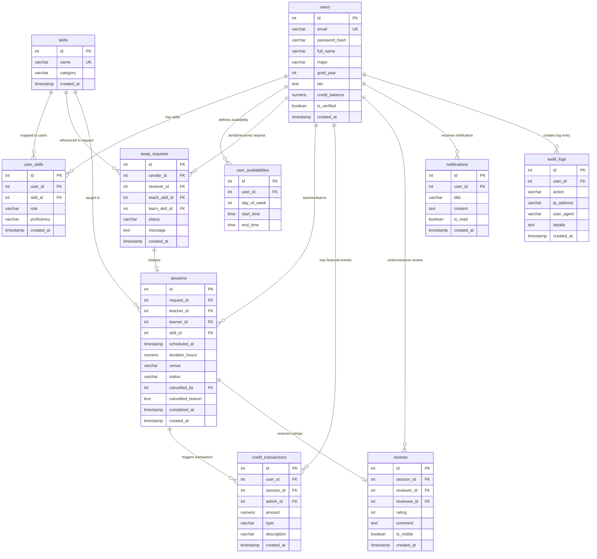

# SkillSwap Campus: Database Architecture Specification
## Phase 2: Relational Database Design (Finalized)

This document details the normalized relational database architecture for the **SkillSwap Campus** application. The target database is **PostgreSQL**, managed on the Python Flask backend via **SQLAlchemy ORM**. All architectural details below incorporate the finalized design decisions.

---

## 1. Entity-Relationship (ER) Diagram



---

## 2. Table Schemas & Definitions

### 2.1 Table: `users`
Stores user authentication details, profile info, and active credit balance.
* **PK:** `id`
* **Unique:** `email`

| Column Name | Data Type | Constraints / Defaults | Description |
| :--- | :--- | :--- | :--- |
| `id` | `SERIAL` | `PRIMARY KEY` | Unique ID. |
| `email` | `VARCHAR(255)` | `NOT NULL`, `UNIQUE` | Verified institutional email address. |
| `password_hash` | `VARCHAR(255)` | `NOT NULL` | Hashed password (bcrypt). |
| `full_name` | `VARCHAR(100)` | `NOT NULL` | User's display name. |
| `major` | `VARCHAR(100)` | `NULL` | Field of study. |
| `grad_year` | `INTEGER` | `NULL`, `CHECK (grad_year >= 2026)` | Expected graduation year. |
| `bio` | `TEXT` | `NULL` | Student self-description. |
| `credit_balance` | `NUMERIC(10, 2)`| `NOT NULL`, `DEFAULT 2.00`, `CHECK (credit_balance >= 0)` | Verified credit balance (cannot go negative). |
| `is_verified` | `BOOLEAN` | `NOT NULL`, `DEFAULT FALSE` | Domain verification status. |
| `created_at` | `TIMESTAMP` | `NOT NULL`, `DEFAULT CURRENT_TIMESTAMP` | Signup timestamp. |

* **Recommended Indexes:**
  * `idx_users_email` (B-Tree on `email`): Quick lookups during login/registration.

---

### 2.2 Table: `skills`
Catalog of all skills available for trading.
* **PK:** `id`
* **Unique:** `name`

| Column Name | Data Type | Constraints / Defaults | Description |
| :--- | :--- | :--- | :--- |
| `id` | `SERIAL` | `PRIMARY KEY` | Unique ID. |
| `name` | `VARCHAR(100)` | `NOT NULL`, `UNIQUE` | Skill identifier (e.g., "Python", "Spanish"). |
| `category` | `VARCHAR(100)` | `NOT NULL` | Skill grouping category. |
| `created_at` | `TIMESTAMP` | `NOT NULL`, `DEFAULT CURRENT_TIMESTAMP` | Catalog addition time. |

* **Recommended Indexes:**
  * `idx_skills_name` (B-Tree on `name`): Speed up autocomplete and search.
  * `idx_skills_category` (B-Tree on `category`): Fast category navigation.

---

### 2.3 Table: `user_skills`
Maps users to the skills they want to teach or learn.
* **PK:** `id`
* **Unique:** `(user_id, skill_id, role)`: Prevents duplicate mappings for a single user/role.

| Column Name | Data Type | Constraints / Defaults | Description |
| :--- | :--- | :--- | :--- |
| `id` | `SERIAL` | `PRIMARY KEY` | Unique ID. |
| `user_id` | `INTEGER` | `NOT NULL`, `FOREIGN KEY REFERENCES users(id) ON DELETE CASCADE` | Associated student. |
| `skill_id` | `INTEGER` | `NOT NULL`, `FOREIGN KEY REFERENCES skills(id) ON DELETE CASCADE` | Associated skill. |
| `role` | `VARCHAR(10)` | `NOT NULL`, `CHECK (role IN ('teach', 'learn'))` | The role this skill plays. |
| `proficiency` | `VARCHAR(15)` | `NOT NULL`, `DEFAULT 'beginner'`, `CHECK (proficiency IN ('beginner', 'intermediate', 'advanced'))` | Student skill level. |
| `created_at` | `TIMESTAMP` | `NOT NULL`, `DEFAULT CURRENT_TIMESTAMP` | Date added. |

* **Recommended Indexes:**
  * `idx_user_skills_composite` (B-Tree on `user_id, role`): Speeds up fetching student portfolios.
  * `idx_user_skills_match` (B-Tree on `skill_id, role`): Speeds up match search algorithms.

---

### 2.4 Table: `user_availabilities`
Stores student weekly availability blocks.
* **PK:** `id`

| Column Name | Data Type | Constraints / Defaults | Description |
| :--- | :--- | :--- | :--- |
| `id` | `SERIAL` | `PRIMARY KEY` | Unique ID. |
| `user_id` | `INTEGER` | `NOT NULL`, `FOREIGN KEY REFERENCES users(id) ON DELETE CASCADE` | Associated student. |
| `day_of_week` | `INTEGER` | `NOT NULL`, `CHECK (day_of_week BETWEEN 0 AND 6)` | 0 = Sunday, 6 = Saturday. |
| `start_time` | `TIME` | `NOT NULL` | Start of availability window. |
| `end_time` | `TIME` | `NOT NULL` | End of availability window. |

* **Check Constraint:** `CHECK (start_time < end_time)`: Ensures logical time ordering.
* **Recommended Indexes:**
  * `idx_user_availability_user` (B-Tree on `user_id`): Quick retrieval of a student's schedule template.

---

### 2.5 Table: `swap_requests`
Tracks requests sent from one user to another to initiate a swap.
* **PK:** `id`

| Column Name | Data Type | Constraints / Defaults | Description |
| :--- | :--- | :--- | :--- |
| `id` | `SERIAL` | `PRIMARY KEY` | Unique ID. |
| `sender_id` | `INTEGER` | `NOT NULL`, `FOREIGN KEY REFERENCES users(id) ON DELETE CASCADE` | Initiating student. |
| `receiver_id` | `INTEGER` | `NOT NULL`, `FOREIGN KEY REFERENCES users(id) ON DELETE CASCADE` | Target student. |
| `teach_skill_id` | `INTEGER` | `NULL`, `FOREIGN KEY REFERENCES skills(id) ON DELETE SET NULL` | Skill sender proposes to teach. |
| `learn_skill_id` | `INTEGER` | `NULL`, `FOREIGN KEY REFERENCES skills(id) ON DELETE SET NULL` | Skill sender proposes to learn. |
| `status` | `VARCHAR(15)` | `NOT NULL`, `DEFAULT 'pending'`, `CHECK (status IN ('pending', 'accepted', 'rejected', 'cancelled'))` | Lifecycle state. |
| `message` | `TEXT` | `NULL` | Optional text pitch. |
| `created_at` | `TIMESTAMP` | `NOT NULL`, `DEFAULT CURRENT_TIMESTAMP` | Proposal date. |

* **Check Constraints:**
  * `CHECK (sender_id != receiver_id)`: Prevents users from requesting themselves.
  * `CHECK (teach_skill_id IS NOT NULL OR learn_skill_id IS NOT NULL)`: Ensures a request carries at least one exchange action.
* **Recommended Indexes:**
  * `idx_swap_requests_sender` (B-Tree on `sender_id`): Filters outgoing requests.
  * `idx_swap_requests_receiver` (B-Tree on `receiver_id`): Filters incoming requests.

---

### 2.6 Table: `sessions`
The scheduled swap bookings originating from accepted requests.
* **PK:** `id`

| Column Name | Data Type | Constraints / Defaults | Description |
| :--- | :--- | :--- | :--- |
| `id` | `SERIAL` | `PRIMARY KEY` | Unique ID. |
| `request_id` | `INTEGER` | `NOT NULL`, `FOREIGN KEY REFERENCES swap_requests(id) ON DELETE CASCADE` | Related exchange agreement. |
| `teacher_id` | `INTEGER` | `NOT NULL`, `FOREIGN KEY REFERENCES users(id) ON DELETE RESTRICT` | Tutor user. |
| `learner_id` | `INTEGER` | `NOT NULL`, `FOREIGN KEY REFERENCES users(id) ON DELETE RESTRICT` | Learner user. |
| `skill_id` | `INTEGER` | `NOT NULL`, `FOREIGN KEY REFERENCES skills(id) ON DELETE RESTRICT` | The skill being taught. |
| `scheduled_at` | `TIMESTAMP` | `NOT NULL` | Date and start time of exchange. |
| `duration_hours` | `NUMERIC(4, 2)`| `NOT NULL`, `CHECK (duration_hours > 0)` | Duration block (e.g. 1.00, 2.00 hours). |
| `venue` | `VARCHAR(255)` | `NOT NULL` | Location (e.g., "Library Room A" or URL). |
| `status` | `VARCHAR(15)` | `NOT NULL`, `DEFAULT 'scheduled'`, `CHECK (status IN ('scheduled', 'completed', 'cancelled', 'disputed', 'expired'))` | Lifecycle stage. |
| `cancelled_by` | `INTEGER` | `NULL`, `FOREIGN KEY REFERENCES users(id)` | User who cancelled or triggered expiry. |
| `cancelled_reason` | `TEXT` | `NULL` | Why the session was cancelled/expired. |
| `completed_at` | `TIMESTAMP` | `NULL` | When the completion was verified. |
| `created_at` | `TIMESTAMP` | `NOT NULL`, `DEFAULT CURRENT_TIMESTAMP` | Booking creation date. |

* **Check Constraints:**
  * `CHECK (teacher_id != learner_id)`: Self-teaching is forbidden.
  * `CHECK ((status IN ('cancelled', 'expired') AND cancelled_by IS NOT NULL) OR (status NOT IN ('cancelled', 'expired') AND cancelled_by IS NULL))`: Enforces cancellation fields audit tracking.
* **Recommended Indexes:**
  * `idx_sessions_teacher` (B-Tree on `teacher_id`): Tracks teaching schedule.
  * `idx_sessions_learner` (B-Tree on `learner_id`): Tracks learning schedule.
  * `idx_sessions_status_sched` (B-Tree on `status, scheduled_at`): Aids expiration background check sweep queries.

---

### 2.7 Table: `credit_transactions`
The transactional audit ledger recording all credit operations (holds, releases, grants, admin adjustments, and transfers).
* **PK:** `id`

| Column Name | Data Type | Constraints / Defaults | Description |
| :--- | :--- | :--- | :--- |
| `id` | `SERIAL` | `PRIMARY KEY` | Unique ID. |
| `user_id` | `INTEGER` | `NOT NULL`, `FOREIGN KEY REFERENCES users(id) ON DELETE CASCADE` | Affected student account. |
| `session_id` | `INTEGER` | `NULL`, `FOREIGN KEY REFERENCES sessions(id) ON DELETE SET NULL` | Triggering session (if applicable). |
| `admin_id` | `INTEGER` | `NULL`, `FOREIGN KEY REFERENCES users(id) ON DELETE RESTRICT` | Admin ID performing change (if applicable). |
| `amount` | `NUMERIC(10, 2)`| `NOT NULL` | Credits transacted (negative for spends/holds, positive for earnings/releases). |
| `type` | `VARCHAR(20)` | `NOT NULL`, `CHECK (type IN ('initial_grant', 'hold_placement', 'hold_release', 'session_spend', 'session_earn', 'admin_adjustment'))` | Transaction category. |
| `description` | `VARCHAR(255)` | `NOT NULL` | Compulsory auditing note details. |
| `created_at` | `TIMESTAMP` | `NOT NULL`, `DEFAULT CURRENT_TIMESTAMP` | Date of transactional execution. |

* **Check Constraints:**
  * `CHECK (type != 'admin_adjustment' OR admin_id IS NOT NULL)`: Enforces admin reference tracking during balance adjustments.
* **Recommended Indexes:**
  * `idx_credit_transactions_user` (B-Tree on `user_id`): Computes balance sums and ledger statements quickly.

---

### 2.8 Table: `reviews`
Holds feedback evaluations submitted after session completions.
* **PK:** `id`
* **Unique:** `(session_id, reviewer_id)`: Restricts each user to one review per session.

| Column Name | Data Type | Constraints / Defaults | Description |
| :--- | :--- | :--- | :--- |
| `id` | `SERIAL` | `PRIMARY KEY` | Unique ID. |
| `session_id` | `INTEGER` | `NOT NULL`, `FOREIGN KEY REFERENCES sessions(id) ON DELETE CASCADE` | Associated session. |
| `reviewer_id` | `INTEGER` | `NOT NULL`, `FOREIGN KEY REFERENCES users(id) ON DELETE CASCADE` | Review author. |
| `reviewee_id` | `INTEGER` | `NOT NULL`, `FOREIGN KEY REFERENCES users(id) ON DELETE CASCADE` | Review target. |
| `rating` | `INTEGER` | `NOT NULL`, `CHECK (rating BETWEEN 1 AND 5)` | 1-5 star scale. |
| `comment` | `TEXT` | `NULL` | Textual feedback. |
| `is_visible` | `BOOLEAN` | `NOT NULL`, `DEFAULT FALSE` | True only when double-blind criteria is met. |
| `created_at` | `TIMESTAMP` | `NOT NULL`, `DEFAULT CURRENT_TIMESTAMP` | Review posting date. |

* **Check Constraints:**
  * `CHECK (reviewer_id != reviewee_id)`: Prevents self-reviewing.
* **Recommended Indexes:**
  * `idx_reviews_reviewee_visible` (B-Tree on `reviewee_id, is_visible`): Aggregates user profile score stats.
  * `idx_reviews_session` (B-Tree on `session_id`): Verifies if reviews are already written.

---

### 2.9 Table: `notifications`
User alert tracker.
* **PK:** `id`

| Column Name | Data Type | Constraints / Defaults | Description |
| :--- | :--- | :--- | :--- |
| `id` | `SERIAL` | `PRIMARY KEY` | Unique ID. |
| `user_id` | `INTEGER` | `NOT NULL`, `FOREIGN KEY REFERENCES users(id) ON DELETE CASCADE` | Target user to notify. |
| `title` | `VARCHAR(150)` | `NOT NULL` | Notification header. |
| `content` | `TEXT` | `NOT NULL` | Message body details. |
| `is_read` | `BOOLEAN` | `NOT NULL`, `DEFAULT FALSE` | Unread filter status flag. |
| `created_at` | `TIMESTAMP` | `NOT NULL`, `DEFAULT CURRENT_TIMESTAMP` | Delivery date. |

* **Recommended Indexes:**
  * `idx_notifications_unread` (B-Tree on `user_id, is_read`): Speeds up fetching active alerts.

---

### 2.10 Table: `audit_logs`
System-wide security and action audit trailing.
* **PK:** `id`

| Column Name | Data Type | Constraints / Defaults | Description |
| :--- | :--- | :--- | :--- |
| `id` | `SERIAL` | `PRIMARY KEY` | Unique ID. |
| `user_id` | `INTEGER` | `NULL`, `FOREIGN KEY REFERENCES users(id) ON DELETE SET NULL` | Responsible actor. |
| `action` | `VARCHAR(100)` | `NOT NULL` | Action identifier (e.g. "ADMIN_ADJUSTMENT", "AUTH_FAILED"). |
| `ip_address` | `VARCHAR(45)` | `NULL` | Client IP address. |
| `user_agent` | `VARCHAR(255)` | `NULL` | Client browser agent. |
| `details` | `TEXT` | `NULL` | Descriptive metadata. |
| `created_at` | `TIMESTAMP` | `NOT NULL`, `DEFAULT CURRENT_TIMESTAMP` | Log date. |

---

## 3. Relationships Mapping

1. **One-to-One Relationships:**
   * **`sessions` ↔ `reviews`**: Explicitly implemented as a `One-to-Many` relational schema, but functionally operates as two distinct 1:1 records (one review authored by the teacher, and one by the learner) due to the composite unique index `UNIQUE(session_id, reviewer_id)`.

2. **One-to-Many Relationships:**
   * **`users` ↔ `user_availabilities`**: A user has multiple weekly time slots.
   * **`users` ↔ `credit_transactions`**: A user accumulates transactions.
   * **`users` ↔ `notifications`**: A user receives many alerts.
   * **`users` ↔ `audit_logs`**: A user triggers many audit trails.
   * **`users` ↔ `swap_requests`**: A student acts as the sender/receiver of multiple request proposals.
   * **`users` ↔ `sessions`**: A student teaches or learns across multiple sessions.
   * **`sessions` ↔ `credit_transactions`**: A session record links to many ledger items.

3. **Many-to-Many Relationships:**
   * **`users` ↔ `skills`**: Conducted via the **`user_skills`** join table. A student holds many skills (defined as either teach or learn); a single skill catalog item connects to many student portfolios.

---

## 4. Business Rules

### 4.1 Time Bank & Transaction Rules
1. **Credit Exchange Ratio**: Fixed as:
   $$\text{Credit Cost} = \text{Session Duration (Hours)}$$
2. **Double Spending Block**: A session cannot be finalized if the learner's `credit_balance` is less than the duration. During session scheduling, the system issues a `hold_placement` type credit transaction, reducing the learner's mutable `users.credit_balance` and preventing concurrency overlap.
3. **Admin Adjustment Constraints**: Administrators must modify balances *only* via writing a log entry in `credit_transactions` with `type = 'admin_adjustment'`. The database enforces `admin_id IS NOT NULL` and `description` is filled. Mutable database triggers or app-level locks enforce that `users.credit_balance` stays matching the transaction log sums.

### 4.2 Review Double-Blind Visibility Rules
1. **Visibility Logic**:
   * Let $R_T$ be the Teacher's review of the Learner, and $R_L$ be the Learner's review of the Teacher.
   * If both $R_T$ and $R_L$ exist in the `reviews` table, the system sets `is_visible = TRUE` for both.
   * If only one review exists (e.g. $R_L$), it remains hidden (`is_visible = FALSE`) until either $R_T$ is submitted, OR the current timestamp exceeds $R_L.\text{created\_at} + 7\text{ days}$.
2. **Access Limitation**: Users cannot create reviews for a session unless:
   * The user is either the `teacher_id` or `learner_id` in the session record.
   * The session `status = 'completed'`.

### 4.3 Credit Hold Expiry & Automatic Resolution
1. **Check Condition**: If a session scheduled timestamp is older than:
   $$\text{Current Time} \ge \text{scheduled\_at} + \text{duration\_hours} + 24\text{ hours}$$
   and the status remains `'scheduled'`, the system triggers expiration processing.
2. **State Resolution**:
   * Change `sessions.status = 'expired'`.
   * Register a `type = 'hold_release'` entry in `credit_transactions` for the learner with positive value equal to session duration.
   * Update the learner's active `users.credit_balance` value.
   * Write an audit log detailing the automated system expiration event.

### 4.4 Booking Availability Locks
1. **API Conflict Checks**: When booking, Flask locks the scheduling records:
   ```sql
   SELECT 1 FROM sessions 
   WHERE (teacher_id = :tid OR learner_id = :lid) 
     AND status = 'scheduled' 
     AND (scheduled_at, scheduled_at + duration_hours * INTERVAL '1 hour') 
         OVERLAPS (:proposed_start, :proposed_start + :duration * INTERVAL '1 hour')
   FOR UPDATE;
   ```
   If this query returns rows, the backend blocks the scheduling due to overlapping conflicts.

---

## 5. Normalization Analysis

The database complies fully with **Third Normal Form (3NF)**:
* **1NF**: All attributes contain scalar values (no comma-separated strings for availability or skills).
* **2NF**: All relations have single-column primary keys (`id`), and all fields in the join tables depend completely on the primary keys.
* **3NF**: There are no transitive dependency columns; data lookup categories and skill definitions are resolved through explicit relations to prevent data redundancy.

---

## 6. Table & Schema Constraints Summary

1. **Check Constraints**:
   * `users.credit_balance >= 0`: The core engine rule ensuring students cannot slide into negative balance.
   * `user_availabilities.start_time < user_availabilities.end_time`: Enforces valid chronological order.
   * `swap_requests.sender_id != swap_requests.receiver_id` and `sessions.teacher_id != sessions.learner_id`: Prevents self-swapping and self-teaching.
   * `swap_requests.teach_skill_id IS NOT NULL OR swap_requests.learn_skill_id IS NOT NULL`: Ensures valid transaction contents.
2. **Unique Constraints**:
   * `users.email` (Unique string).
   * `skills.name` (Unique string).
   * `user_skills(user_id, skill_id, role)`: Blocks redundant configurations.
   * `reviews(session_id, reviewer_id)`: Imposes double-blind limit boundaries.

---

## 7. Index Design

| Index Name | Table | Type | Covered Columns | Purpose |
| :--- | :--- | :--- | :--- | :--- |
| `idx_users_email` | `users` | B-Tree | `email` | Rapid onboarding and auth queries. |
| `idx_user_skills_composite` | `user_skills` | B-Tree | `user_id, role` | Portfolios matching. |
| `idx_user_skills_match` | `user_skills` | B-Tree | `skill_id, role` | Dynamic search query optimizations. |
| `idx_sessions_status_sched` | `sessions` | B-Tree | `status, scheduled_at` | Expiration background sweeping checks. |
| `idx_credit_transactions_user`| `credit_transactions` | B-Tree | `user_id` | Aggregating credit history ledger sums. |
| `idx_reviews_reviewee_visible`| `reviews` | B-Tree | `reviewee_id, is_visible`| Aggregate profile score calculations. |

---

## 8. Database Architecture Approval Checklist

These architectural verifications must be confirmed before proceeding to **Phase 3 (Database Implementation)**:

1. [ ] Do we have verification of the system execution rules for double-blind reviews (waiting for both reviews OR the 7-day timestamp threshold check)?
2. [ ] Is the proposed SQL transaction design (`SELECT ... FOR UPDATE` row-level blocking on user records) approved for production concurrency safety instead of database-wide `SERIALIZABLE` mode?
3. [ ] Are the cascading deletes on `user_skills` and `user_availabilities` approved, and the `RESTRICT` delete behaviors on `sessions` (to prevent accidental data loss of completed histories) confirmed?
4. [ ] Is the database schema naming convention and data type sizing (e.g. `NUMERIC(10, 2)` for credit tracking) locked for migration creation?
