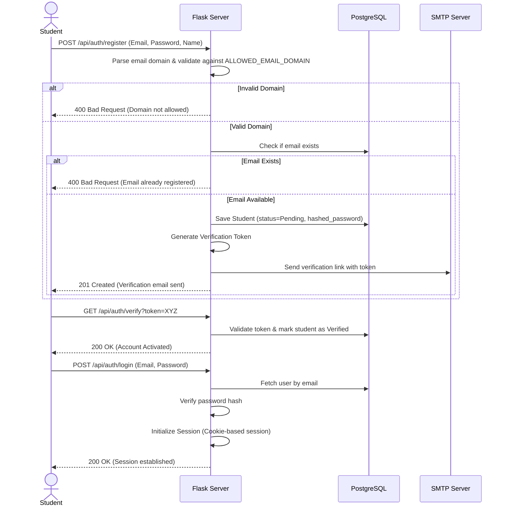
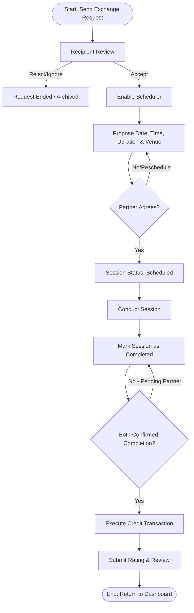

# Software Requirements Specification (SRS)
## Project Name: SkillSwap Campus

---

## 1. Problem Statement

At modern university campuses, students possess a rich, diverse set of skills—ranging from academic subjects (e.g., organic chemistry, algorithms) to practical and creative abilities (e.g., video editing, cooking, conversational French). However, there is no structured, trusted, or efficient mechanism for students to share these skills.

Currently, students face several friction points:
* **High Financial Barriers:** Professional tutoring and extracurricular classes are financially prohibitive for many college students.
* **Frictional Discovery:** Informal channels like bulletin boards, chat groups, and social media are fragmented, disorganized, and spam-heavy, making it difficult to find reliable exchange partners.
* **Underutilized Campus Capital:** A student who excels in calculus but struggles with public speaking has no easy way to trade their calculus expertise directly for public speaking guidance.
* **Safety and Trust Issues:** Exchanging services with unverified individuals off-campus raises safety and reliability concerns.

**SkillSwap Campus** solves these issues by creating a private, college-validated, non-monetary, peer-to-peer knowledge-sharing marketplace where students trade skills directly using their time as currency (time-banking) or through reciprocal swaps.

---

## 2. Target Users

The primary target users are **currently enrolled university students** looking to:
1. **Academic Learners/Tutors:** Students needing peer tutoring in specific coursework or preparing for exams, and students wanting to reinforce their own knowledge by teaching others.
2. **Skill-Seekers:** Students wanting to learn non-academic, practical, or recreational skills (e.g., guitar, UI/UX design, interview prep, fitness training).
3. **Budget-Conscious Students:** Students who cannot afford professional tutoring or extracurricular courses.
4. **Community Builders:** Students seeking to meet peers with common interests and expand their social and professional network on campus.

---

## 3. Main Objectives

* **Zero-Cost Peer Learning:** Establish a time-banking/credit or reciprocal system where the only medium of exchange is a student's time and knowledge.
* **Verified Trust Community:** Restrict registration exclusively to students with valid institutional emails (`.edu`) to ensure a safe, closed campus ecosystem.
* **Frictionless Matching:** Create a deterministic matching system that automatically highlights students whose teaching capabilities align with another's learning interests.
* **Accountability & Structure:** Provide integrated scheduling, calendar tracking, and feedback loops to ensure students show up and receive quality exchanges.
* **Scale Campus Engagement:** Increase community interaction, collaboration, and student-led development.

---

## 4. User Roles

The platform defines three main user roles:

| Role | Permissions & Responsibilities |
| :--- | :--- |
| **Guest / Anonymous User** | Can view the public homepage, features list, and statistics. Cannot view student profiles, search the directory, or send requests. |
| **Verified Student (User)** | The core actor. Can register/verify with a university email, manage their profile, add teaching/learning skills, search/filter other students, send/receive requests, schedule sessions, earn/spend swap credits, and submit ratings/feedback. |
| **Platform Administrator** | Manages the system. Can create/modify skill categories, review flagged profiles or sessions, resolve disputes, view dashboard statistics, and deactivate accounts violating community guidelines. |

---

## 5. System Workflows

### 5.1 Authentication Workflow


### 5.2 Exchange & Session Lifecycle Workflow


### 5.3 Rating & Review Workflow
1. **Trigger:** A session reaches the `Completed` state.
2. **Double-Blind Review submission:**
   * Both the Mentor (Teacher) and Mentee (Learner) are prompted to rate the session on a scale of 1 to 5 stars, alongside optional text feedback.
   * Feedback is classified into:
     * *Mentor Feedback on Mentee:* Rated on preparation, respectfulness, and punctuality.
     * *Mentee Feedback on Mentor:* Rated on teaching effectiveness, subject mastery, and punctuality.
3. **Publication:** Ratings and reviews are published on each user's profile once both sides submit their feedback, or after a 7-day grace period (to prevent retaliation or biased reviews).
4. **Aggregation:** The system recalculates the aggregate average rating for both users in their roles as Mentor and Mentee.

---

## 6. Functional Requirements

### 6.1 Authentication & Onboarding
* **FR-1.1 Configurable Email Verification:** Users must register with an email domain matching the system configuration variable `ALLOWED_EMAIL_DOMAIN` (e.g., `*.edu` or `specific-college.edu`).
* **FR-1.2 Profile Onboarding:** Users must complete their profile containing:
  * Full Name
  * Major/Field of Study
  * Graduation Year
  * Biography
  * Skills to Teach (must list at least one to complete onboarding)
  * Skills to Learn (must list at least one to complete onboarding)

### 6.2 Profile & Skill Management
* **FR-2.1 Profile Editing:** Users can edit their profile info, update their lists of skills to teach/learn, and define their weekly availability slots.
* **FR-2.2 Skill Portfolio Catalog:** Users select skills from pre-defined, admin-curated categories (e.g., *Software Development, Calculus, Spanish, Guitar*). Custom skill entry must be flagged for admin approval before showing in global search.
* **FR-2.3 Self-Reported Proficiency:** Users label skills with a proficiency level (*Beginner, Intermediate, Advanced*).

### 6.3 Deterministic Skill Matching & Discovery (Non-AI)
* **FR-3.1 Matchmaking Logic:** The matching feed displays students sorted by match suitability without using AI models. Matches are grouped as:
  * **Direct Reciprocal Matches:** Find users where `UserA.TeachSkills ∩ UserB.LearnSkills ≠ ∅` AND `UserB.TeachSkills ∩ UserA.LearnSkills ≠ ∅`.
  * **One-Way Matches (Teaches):** Find users where `UserA.LearnSkills ∩ UserB.TeachSkills ≠ ∅`.
  * **One-Way Matches (Learns):** Find users where `UserA.TeachSkills ∩ UserB.LearnSkills ≠ ∅`.
* **FR-3.2 Advanced Directory Search:** Users can filter the student directory using filters:
  * Skill Name (exact and substring match)
  * Skill Category
  * Rating threshold (e.g., `rating >= 4.0`)
  * Availability status

### 6.4 Swap Request & Scheduling
* **FR-4.1 Propose Swap:** Users can send a swap request specifying the skills involved (e.g., "I will teach you Python; I want to learn French from you").
* **FR-4.2 Credit Validation during Booking:** The system must check if the learner has at least 1 credit available before allowing them to book a session.
* **FR-4.3 Interactive Scheduling Scheduler**: Enabled upon request acceptance. Users propose date, start time, duration (must be in blocks of hours: 1, 2, or 3 hours), and meeting location (physical campus spot or virtual URL).

### 6.5 Time Bank & Transaction Logging
* **FR-5.1 Credit Tracking:** Every profile must contain a `credit_balance` attribute.
* **FR-5.2 Ledger Logging:** Every addition or subtraction of credits must write a permanent record to the `credit_transactions` database table.
* **FR-5.3 Overdraft Prevention:** The backend API must block any transaction that would result in a student's `credit_balance` falling below `0`.

---

## 7. Time Bank & Credit Transaction Rules

The Time Bank system operates on a non-monetary currency model called "Swap Credits."

### 7.1 Core Credit Rules
1. **Exchange Rate:** The exchange rate is strictly proportional to session duration:
   $$\text{Credit Cost} = \text{Session Duration (in Hours)}$$
   * 1 hour taught = $+1.0$ Credit earned by the Mentor.
   * 1 hour learned = $-1.0$ Credit spent by the Mentee.
2. **Initial Balance:** Newly verified students receive a starting balance of **2.0 credits** to seed initial requests.
3. **No Dual Exchange Limitation:** Students do not need to find a partner for a direct bilateral swap. Student A can teach Student B (earning credit from B), and later spend that credit to learn from Student C.

### 7.2 Transaction Rules
* **Transaction Execution:**
  * When a session is scheduled, the learner's credit equivalent to the session duration is placed in a `Pending Hold` state. The learner's active spendable balance is temporarily reduced by this amount.
  * If the session is successfully marked as `Completed` by both parties, the pending hold is released, and the credit is officially credited to the teacher.
  * If the session is cancelled before execution, the pending hold is released, returning the credits to the learner.
* **Atomic Operations:** All credit transfers must execute within a database transaction block to guarantee that credit creation and deduction are atomic (ensuring data integrity in case of network or database failure).
* **Prevention of Negative Balance:** The system rejects booking requests if the user's `spendable_balance` (active balance minus pending holds) is less than the proposed session duration.
  $$\text{Spendable Balance} = \text{Active Balance} - \sum \text{Pending Hold Durations}$$

---

## 8. Skill Matching Rules

The Skill Matchmaker is deterministic, transparent, and operates strictly without AI:

1. **Reciprocal Match Scoring:**
   * A match score is calculated between two users, $A$ and $B$:
     $$\text{Score}(A, B) = |A.\text{Teach} \cap B.\text{Learn}| \times 2 + |B.\text{Teach} \cap A.\text{Learn}| \times 2$$
   * Matches with score $> 0$ on both terms are listed as "Direct Reciprocal Matches" and sorted to the top.
2. **One-Way Match Scoring:**
   * If a reciprocal match is not found, users are displayed if there is a single overlap:
     $$\text{Score}_{\text{teaches}}(A, B) = |B.\text{Teach} \cap A.\text{Learn}|$$
3. **Tie-Breaker Hierarchy:**
   * If scores are equal, ties are resolved dynamically by:
     1. User average rating (descending).
     2. Last active timestamp (descending).

---

## 9. Non-Functional Requirements

### 9.1 Performance & Scalability
* **NFR-1.1 Query Optimization:** Skill matching queries must run in under 100ms on a database with up to 10,000 active profiles.
* **NFR-1.2 Cache Headers:** Static files (HTML, CSS, JS) must serve with appropriate caching headers for rapid browser rendering.

### 9.2 Usability & Compatibility
* **NFR-2.1 Framework Independence:** Frontend must execute on modern browsers using native HTML5, CSS3, and ES6+ JavaScript.
* **NFR-2.2 Interface:** Fully responsive design layout targeting mobile-first viewport styling.

### 9.3 Security & Reliability
* **NFR-3.1 Secure Session Management:** Session identifiers must be stored in secure, `HttpOnly`, `SameSite=Lax` cookies to prevent XSS (Cross-Site Scripting) and CSRF (Cross-Site Request Forgery) attacks.
* **NFR-3.2 Input Sanitization:** All text inputs (bios, reviews, messages) must be sanitized before db writes and output rendering.
* **NFR-3.3 Database Integrity:** Use foreign key constraints and transactional scopes in SQLAlchemy.

---

## 10. Database Requirements

The application will use a PostgreSQL database managed via Python's **SQLAlchemy** ORM.

### 10.1 Schema Diagram Relationship (Logical)
* **User:** Holds profile details, email, hashed password, activation state, and active credit balance.
* **Skill:** Global lookup table for pre-defined categories and skills.
* **UserSkill:** Join table indicating user relationship to skills. Tracks whether the skill is to `teach` or `learn` and user's proficiency.
* **SwapRequest:** Record of requests between sender and recipient.
* **Session:** Log of scheduled swaps, dates, locations, states, and duration.
* **CreditTransaction:** Log of credit movement. Foreign keys linking to the User (sender/receiver) and the matching Session.
* **Review:** Holds rating values (1-5), review commentary, and links to the associated Session.

### 10.2 Table Schema Definition

```sql
-- User Profile & Authentication Table
CREATE TABLE users (
    id SERIAL PRIMARY KEY,
    email VARCHAR(255) UNIQUE NOT NULL,
    password_hash VARCHAR(255) NOT NULL,
    full_name VARCHAR(100) NOT NULL,
    major VARCHAR(100),
    grad_year INTEGER,
    bio TEXT,
    credit_balance NUMERIC(10, 2) DEFAULT 2.00 NOT NULL,
    is_verified BOOLEAN DEFAULT FALSE NOT NULL,
    created_at TIMESTAMP DEFAULT CURRENT_TIMESTAMP
);

-- Skills Catalog Table
CREATE TABLE skills (
    id SERIAL PRIMARY KEY,
    name VARCHAR(100) UNIQUE NOT NULL,
    category VARCHAR(100) NOT NULL
);

-- User-Skill Mapping (Teaches vs Learns)
CREATE TYPE skill_role_enum AS ENUM ('teach', 'learn');
CREATE TYPE proficiency_enum AS ENUM ('beginner', 'intermediate', 'advanced');

CREATE TABLE user_skills (
    id SERIAL PRIMARY KEY,
    user_id INTEGER REFERENCES users(id) ON DELETE CASCADE,
    skill_id INTEGER REFERENCES skills(id) ON DELETE CASCADE,
    role skill_role_enum NOT NULL,
    proficiency proficiency_enum DEFAULT 'beginner',
    UNIQUE(user_id, skill_id, role)
);

-- Swap Requests
CREATE TYPE request_status_enum AS ENUM ('pending', 'accepted', 'rejected', 'cancelled');

CREATE TABLE swap_requests (
    id SERIAL PRIMARY KEY,
    sender_id INTEGER REFERENCES users(id) ON DELETE CASCADE,
    receiver_id INTEGER REFERENCES users(id) ON DELETE CASCADE,
    teach_skill_id INTEGER REFERENCES skills(id),
    learn_skill_id INTEGER REFERENCES skills(id),
    status request_status_enum DEFAULT 'pending' NOT NULL,
    message TEXT,
    created_at TIMESTAMP DEFAULT CURRENT_TIMESTAMP
);

-- Scheduled Sessions
CREATE TYPE session_status_enum AS ENUM ('scheduled', 'completed', 'cancelled', 'disputed');

CREATE TABLE sessions (
    id SERIAL PRIMARY KEY,
    request_id INTEGER REFERENCES swap_requests(id) ON DELETE CASCADE,
    scheduled_at TIMESTAMP NOT NULL,
    duration_hours NUMERIC(4, 2) NOT NULL,
    venue VARCHAR(255) NOT NULL, -- Physical location or URL link
    status session_status_enum DEFAULT 'scheduled' NOT NULL,
    created_at TIMESTAMP DEFAULT CURRENT_TIMESTAMP
);

-- Credit Transactions Audit Ledger
CREATE TYPE transaction_type_enum AS ENUM ('earning', 'spending', 'hold_placement', 'hold_release');

CREATE TABLE credit_transactions (
    id SERIAL PRIMARY KEY,
    user_id INTEGER REFERENCES users(id) ON DELETE CASCADE,
    session_id INTEGER REFERENCES sessions(id) ON DELETE SET NULL,
    amount NUMERIC(10, 2) NOT NULL, -- Positive for earning, Negative for spending
    type transaction_type_enum NOT NULL,
    description VARCHAR(255),
    created_at TIMESTAMP DEFAULT CURRENT_TIMESTAMP
);

-- Session Reviews Table
CREATE TABLE reviews (
    id SERIAL PRIMARY KEY,
    session_id INTEGER REFERENCES sessions(id) ON DELETE CASCADE,
    reviewer_id INTEGER REFERENCES users(id) ON DELETE CASCADE,
    reviewee_id INTEGER REFERENCES users(id) ON DELETE CASCADE,
    rating INTEGER CHECK (rating >= 1 AND rating <= 5) NOT NULL,
    comment TEXT,
    created_at TIMESTAMP DEFAULT CURRENT_TIMESTAMP,
    UNIQUE(session_id, reviewer_id)
);
```

---

## 11. API Requirements (REST)

The Flask backend exposes the following REST API endpoints:

### 11.1 Authentication & Profile Endpoints
* `POST /api/auth/register` - Create account, validate email domain against configuration, trigger verification email.
* `POST /api/auth/login` - Validate credentials, sign session cookie.
* `POST /api/auth/logout` - Invalidate active session cookie.
* `GET /api/profile` - Fetch current user's profile, including active and spendable credit balances.
* `PUT /api/profile` - Update user bio, major, graduation year.
* `POST /api/profile/skills` - Add/Update skills list to teach or learn.

### 11.2 Search & Matches
* `GET /api/matches` - Returns list of matches using deterministic scoring.
* `GET /api/students` - Queries directory using search parameters (`skill`, `category`, `min_rating`).

### 11.3 Swap Requests & Sessions
* `POST /api/requests` - Propose swap request to another student.
* `GET /api/requests` - List incoming and outgoing swap requests.
* `PUT /api/requests/<id>` - Accept, Reject, or Cancel request.
* `POST /api/sessions` - Schedule a session linked to an accepted request (verifies user credit balance).
* `PUT /api/sessions/<id>/complete` - Mark session completed (executes ledger transfer when both complete).

### 11.4 Transactions & Reviews
* `GET /api/transactions` - Fetch credit logs history for the logged-in user.
* `POST /api/reviews` - Post rating and comments for a completed session.

---

## 12. Security Requirements

1. **SQL Injection Prevention:** Avoid raw SQL string formatting. All database accesses must execute using **SQLAlchemy's query builders or bound parameter parameters**.
2. **Password Cryptography:** Store passwords hashed with **bcrypt**; verify password verification using `bcrypt.check_password_hash()`.
3. **Role-Based API Guarding:** Use a custom decorator (e.g., `@login_required` or `@admin_required`) to check user authentication and permissions at all API boundary entries.
4. **Rate Limiting:** Protect registration, login, and email verification endpoints using rate limiters (e.g., **Flask-Limiter**) to prevent brute-force attacks.

---

## 13. Future Scope

* **Group Workshops:** Enable a tutor to schedule a session for multiple learners, earning credits proportional to the group attendance.
* **Integrations:** Integration with Google Calendar API and Zoom API for meeting link creations.
* **Push Notifications:** Setup real-time push or SMS reminders to lower no-show rates on campus.
